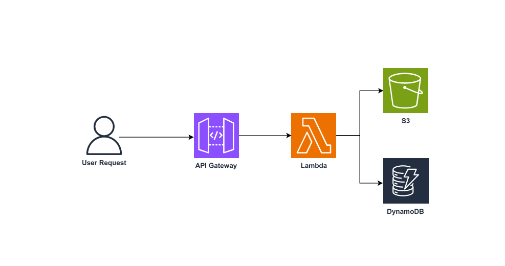

# Image Management with AWS Lambda, API Gateway, S3, and DynamoDB

## Project Description

This project is a serverless application developed with AWS Lambda, API Gateway, Amazon S3, and DynamoDB. The application receives an image encoded in Base64, uploads it to an S3 bucket, stores metadata in DynamoDB, and returns the public URL of the image.

## Project Setup

1. **Create the Lambda Function**: In AWS Lambda, create a function with permissions to access S3 and DynamoDB.
  
2. **Configure API Gateway**: Create an API in API Gateway that triggers the Lambda function using the POST method. The request body should be a JSON containing the image in Base64.

3. **Create the S3 Bucket**: Create an S3 bucket where the images will be stored, and set the necessary permissions for the Lambda function to write to it.

4. **Create the DynamoDB Table**: In DynamoDB, create a table named "Images" with "ImageId" as the primary key.

5. **Testing with Postman**: Use Postman to send requests to the API Gateway and verify that the image is correctly stored in S3 and that the metadata is saved in DynamoDB.

##

  

